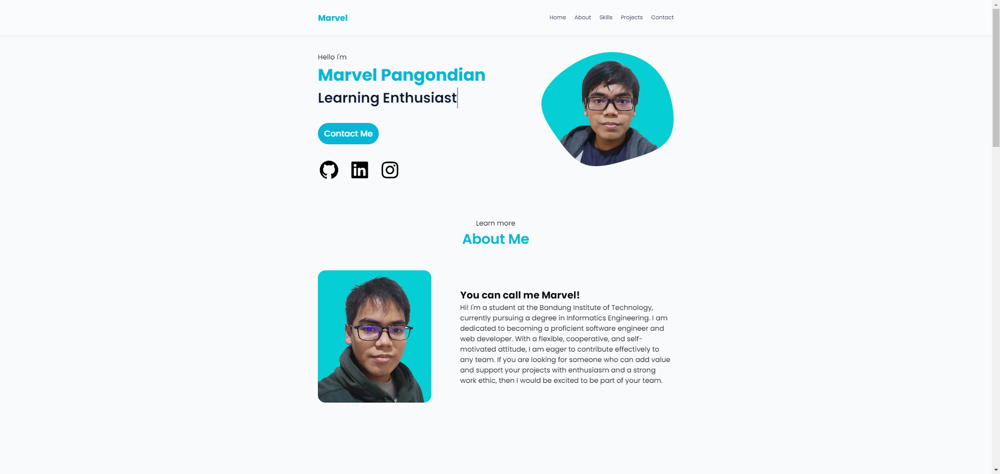
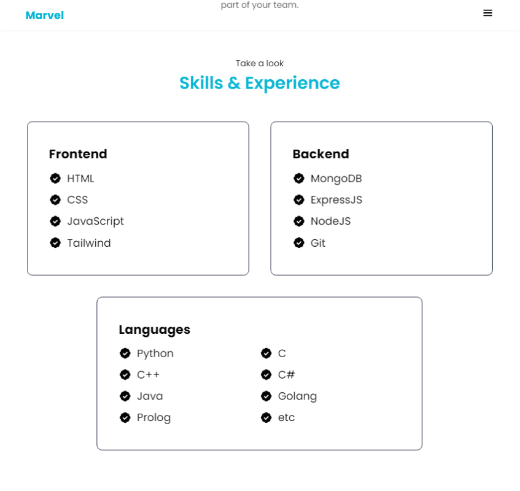

# Portfolio Website
> A simple portfolio website using HTML and CSS.

## Table of Contents
* [General Info](#general-information)
* [Technologies Used](#technologies-used)
* [Features](#features)
* [Screenshots](#screenshots)
* [Setup](#setup)
* [Usage](#usage)
* [Project Status](#project-status)
* [Room for Improvement](#room-for-improvement)
* [Contact](#contact)
<!-- * [License](#license) -->


## General Information
- Portfolio Website using both HTML and CSS
- Uses semantic HTML
- Website is responsive
- Simple and creative use of colors and typography
- Interactive Design
- Accessible Website
- Optimized Performance

## Technologies Used
- HTML
- CSS

## Features
List the ready features here:
- Responsive Design
- Interactive Design
- Optimized for both mobile and desktop


## Screenshots
<br><br>



## Setup
- Clone Repository

  ```
  git clone https://github.com/MarvelPangondian/portfolio-website
  ```
- Download Live Server in VScode

## Usage
- View website using Live Server in Vscode
## Project Status
Project is:  _open for future modifications_ . 


## Room for Improvement

Room for improvement:
- Increase Accessibility


## Contact
Created by [Marvel Pangondian](https://www.linkedin.com/in/marvel-pangondian-104811284?lipi=urn%3Ali%3Apage%3Ad_flagship3_profile_view_base_contact_details%3BqNNY1OXURf%2BuR%2F9CxkJ34A%3D%3D) - feel free to contact me!
