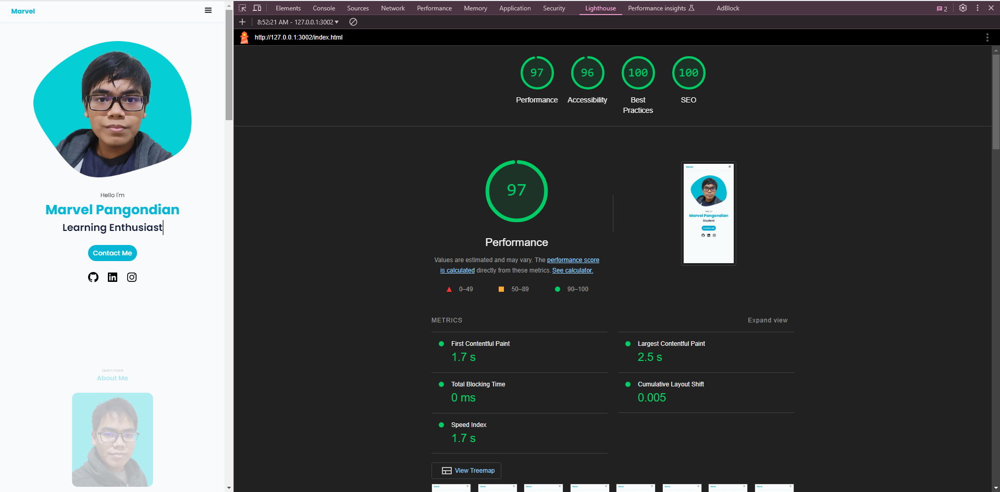

# Portfolio Website
> A simple portfolio website built using HTML and CSS.

## Table of Contents
* [General Information](#general-information)
* [Technologies Used](#technologies-used)
* [Features](#features)
* [Screenshots](#screenshots)
* [Setup](#setup)
* [Usage](#usage)
* [Project Status](#project-status)
* [Room for Improvement](#room-for-improvement)
* [Contact](#contact)

## General Information
- This is a personal portfolio website showcasing projects and skills using HTML and CSS.
- The website utilizes semantic HTML elements for better structure and accessibility.
- It features a responsive design, ensuring optimal viewing across various devices.
- Creative use of colors and typography enhances the visual appeal.
- Interactive elements provide a dynamic user experience.
- Accessibility improvements ensure the website is usable for all visitors.
- Performance optimizations contribute to faster load times.

## Technologies Used
- HTML
- CSS

## Features
- **Responsive Design:** The website is optimized for both desktop and mobile devices.
- **Interactive Elements:** Engaging and user-friendly design.
- **Performance Optimization:** Faster load times for a smooth user experience.

## Screenshots
<br><br>
<br><br>
<br><br>
<br><br>


## Setup
1. Clone the repository:
   ```bash
   git clone https://github.com/MarvelPangondian/portfolio-website
   ```

2. Install the Live Server extension in VS Code.

## Usage
- Open the project folder in VS Code.
- Start Live Server to view the website locally.

## Project Status
The project is currently _open for future modifications_.


## Room for Improvement

Room for improvement:
- Further improvements can be made to enhance accessibility features.


## Contact
Created by [Marvel Pangondian](https://www.linkedin.com/in/marvel-pangondian-104811284?lipi=urn%3Ali%3Apage%3Ad_flagship3_profile_view_base_contact_details%3BqNNY1OXURf%2BuR%2F9CxkJ34A%3D%3D) - feel free to contact me!
